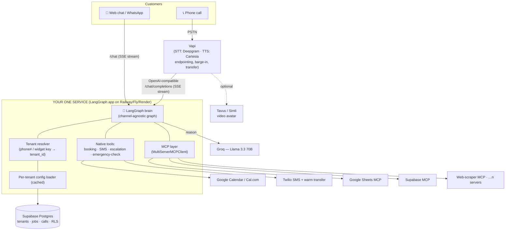

# AI Receptionist — A-Z Build Plan

**Multi-tenant · one brain, two channels · Groq-powered · lowest-cost, lowest-latency**

*Prepared 20 July 2026. All pricing verified against live sources on this date (see References).*

---

## 1. What we're building (executive summary)

A single backend service — the **LangGraph "brain"** — that answers both phone calls and chat, for **many businesses at once** (multi-tenant), and books jobs, sends confirmations, and escalates emergencies.

- **One brain, two channels.** The exact same LangGraph agent serves the phone (via Vapi in *Custom LLM* mode) and a web/WhatsApp chatbot. You write the logic once.
- **Multi-tenant from day one.** Each business (tenant) has its own phone number, cloned voice, system prompt, hours, services, escalation rules, calendar, and enabled MCP servers — all rows in one Supabase database, isolated by `tenant_id`.
- **Groq Llama 3.3 70B** is the reasoning model inside the brain: ~250 tokens/sec and ~$0.59/$0.79 per million tokens — the single biggest lever for your "fast + cheap" goal.
- **"Under one roof."** You deploy and run **exactly one service** (the brain). Everything else is managed SaaS you call over the network (Vapi, Groq, Supabase, Twilio, Cartesia/Deepgram). No second server to babysit.
- **Native MCP.** The brain loads tools from any number of MCP servers per tenant (Google Sheets, Supabase, web scrapers, …) via `langchain-mcp-adapters`.

The two "wants" — **your/someone's voice** and **your/someone's avatar** — are handled by Cartesia voice cloning and an optional Tavus/Simli video avatar layer, added without touching the brain.

---

## 2. How this hits your three hard constraints

| Constraint | How the design satisfies it |
|---|---|
| **Lowest latency** | Groq (fastest inference), Cartesia Sonic TTS (~40ms first byte), Deepgram streaming STT, token streaming end-to-end, and "acknowledge-then-act" so tool calls never block the first response. Target **600–800ms** end-of-speech → first audio. |
| **Low cost** | Groq for the LLM (pennies), Vapi's usage-only $0.05/min platform fee, no per-seat SaaS, one tiny hosting bill ($5–20/mo). Voice ≈ **$0.09–0.15/min all-in**; chat is essentially free. No $299/mo scheduling platform required (see §10). |
| **One deployment / under one roof** | You run **one** service (the brain). All other pieces are APIs. One repo, one deploy target, one database. |

---

## 3. Architecture overview



**Reading the diagram:** every conversational turn — phone or chat — enters the same brain. The brain figures out *which tenant* it's serving, loads that tenant's config, reasons with Groq, and calls tools (native for the critical path, MCP for the long tail). The only box you host is the dashed "YOUR ONE SERVICE" group.

---

## 4. Component choices at a glance

| Layer | Choice | Why | Cost (verified Jul 2026) |
|---|---|---|---|
| Voice orchestration | **Vapi** (Custom LLM mode) | Handles STT/TTS/telephony/endpointing/barge-in/transfer so you don't. Swappable for Retell/Pipecat later without touching the brain. | $0.05/min platform |
| Reasoning model | **Groq — Llama 3.3 70B Versatile** | Fastest tokens/sec, near-free. Your latency + cost goals in one pick. | $0.59 / $0.79 per M tok |
| STT | **Deepgram Nova** (via Vapi) | Streaming, accurate, cheap. | ~$0.0043–0.0092/min |
| TTS + voice clone | **Cartesia Sonic** (via Vapi) | ~40ms first-byte; cheap cloning (the "your voice" want). | ~$0.03/min; clone train = credits |
| Brain framework | **LangGraph** | Stateful graph, streaming, native MCP adapters, one graph for both channels. | Open source |
| App database | **Supabase Postgres** | Multi-tenant store + Row-Level Security + Vault for secrets. Also usable as an MCP tool. | Free → $25/mo Pro |
| Booking | **Google Calendar (default) behind a provider interface** | Free, trades already use it; Cal.com optional. (See §10.) | Free (Google API) |
| SMS / confirmations | **Twilio** | Confirmations + emergency alerts; WhatsApp channel. | ~$0.008/msg + carrier fees |
| Escalation | **Vapi warm/blind transfer** + Twilio SMS | Live handoff on emergencies. | included / per-min |
| MCP | **langchain-mcp-adapters** (`MultiServerMCPClient`) | Connect unlimited MCP servers per tenant. | Open source |
| Avatar (want) | **Tavus** (Vapi-integrated) or **Simli** | Real-time video face; add-on, no brain changes. | per-min add-on |
| Hosting | **Railway / Fly / Render** (one service) | The single thing you run. | $5–20/mo |
| Observability | **LangSmith** + Vapi call logs | Trace every turn; debug latency. | free/dev tier |

---

## 5. The brain (LangGraph) design

The brain is a **channel-agnostic graph**. A thin adapter at each entry point converts the incoming request into the same internal state, so the graph never needs to know if it's talking to a phone or a chat box.

**Graph state (per conversation):**
`tenant_id`, `channel` (`voice` | `chat`), `messages`, `caller` (name/phone/address as collected), `intent`, `emergency` flag, `booking_draft`, `tools_available`, `config` (the tenant profile).

**Node flow (conceptually):**

1. **Resolve tenant** → load config (cached; ~1 DB read, then in-memory).
2. **Safety / emergency classifier** (fast) → sets `emergency` if the utterance matches trade-specific danger patterns.
3. **Router / intent** → book, reschedule, cancel, question, quote, human, emergency.
4. **Reason (Groq)** with the tenant's system prompt + the *allowed* tool set for this tenant/channel.
5. **Tool execution** → native tools (booking, SMS, transfer) and/or MCP tools.
6. **Respond (streamed)** → tokens flow out immediately; TTS starts on the first sentence.

**Two tool tiers (deliberate, for latency + reliability):**

- **Native, typed tools** for the critical path — `book_job`, `check_availability`, `send_confirmation`, `escalate`, `is_emergency`. Fast, validated, predictable.
- **MCP tools** for the long tail — Google Sheets, Supabase queries, scrapers, CRM, etc. Loaded per tenant, kept off the first-response path where possible.

**Streaming is non-negotiable.** The graph must emit tokens as Groq produces them (LangGraph's streaming + an SSE response), because Vapi starts speaking on partial text. Waiting for the full graph to finish would blow the latency budget.

---

## 6. Multi-tenancy design

This is the biggest architectural consequence of your "multi-tenant product" choice. Four parts:

**a) Tenant resolution.**
- *Voice:* each business gets its own phone number. You provision **one Vapi assistant per tenant** (created via the Vapi API, carrying that tenant's cloned voice, greeting, and `metadata.tenant_id`), all pointing at the **same** server URL. The webhook payload tells the brain which tenant is calling.
- *Chat:* the embeddable widget carries a public tenant key (or you route by subdomain). WhatsApp routes by the destination number.

**b) One database, isolated by `tenant_id` (Supabase Postgres + RLS).** Indicative schema:

| Table | Purpose |
|---|---|
| `tenants` | name, trade, timezone, business hours, escalation phone, booking provider, `vapi_assistant_id`, `voice_id`, status |
| `services` | per-tenant service catalog (name, duration, price, emergency?) |
| `intents` | per-trade intent + emergency keyword config (or JSON on `tenants`) |
| `jobs` | bookings: customer, phone, address, service, `scheduled_at`, status, `calendar_event_id`, channel |
| `calls` | call id, transcript, outcome, recording URL, duration, cost |
| `messages` | chat transcripts |
| `mcp_servers` | per-tenant MCP endpoints + auth (which servers this tenant may use) |
| `secrets` | encrypted per-tenant credentials (calendar tokens, API keys) — Supabase Vault |

Every table carries `tenant_id`; **Row-Level Security** policies enforce isolation as defense-in-depth even though the backend already scopes every query.

**c) Per-tenant config loader.** On each turn the brain loads the tenant profile (system prompt, hours, services, escalation number, `voice_id`, enabled MCP servers, booking provider). Cache it in memory with a short TTL so it's one DB read per cold conversation, not per turn.

**d) Onboarding / provisioning flow** (this becomes your "add a client" button):
1. Create `tenants` row + services + hours.
2. Get a phone number (Twilio) and import to Vapi.
3. **Clone the voice** in Cartesia (upload consented sample → `voice_id`).
4. Create the Vapi assistant (voice_id + greeting + server URL + `tenant_id`).
5. Connect the calendar (Google OAuth or Cal.com).
6. Register MCP servers for the tenant.
7. Flip status → live.

**Amendment (Phase 4 implementation, plan authored 20 Jul 2026 build): three changes from
the section above, all recorded with full rationale in `plans/phase4.md`.**

- **Tenant config stays hybrid, not fully in Supabase.** `content/tenants/*.json` remains
  the file you edit and the brain's actual read path; the `tenants`/`services` tables in
  (b) above exist and stay current via `scripts/sync_tenants.py`, but nothing queries them
  yet. This was a deliberate scope cut, not an oversight: the test suite's autouse
  `no_network` guard runs *after* an earlier fixture that would need to query tenant
  config, so flipping the read path needed its own live-verified step — deferred behind a
  single `TENANT_SOURCE=supabase` setting once that's done.
- **PostgREST over raw `httpx`, not a Postgres SDK, for everything except one thing.**
  Section (b)'s `tenant_id`-scoped RLS is implemented exactly as specified — enforced with
  `FORCE ROW LEVEL SECURITY` plus a policy reading a short-lived per-tenant JWT the backend
  mints itself (no `authenticated` role, no end-user auth involved) — but reached over
  Supabase's REST API rather than a database driver, matching the "raw httpx, no SDKs"
  precedent §10's amendment already set for Cal.com. The one exception: the LangGraph
  Postgres checkpointer needs a real transactional connection PostgREST can't offer, so it
  uses `psycopg` — shipped as an optional, self-degrading extra so that compiled dependency
  never blocks the rest of the app if it can't install somewhere.
- **Free-tier retention, not assumed unlimited storage.** Supabase's free tier is 500MB
  with no TTL on LangGraph's own checkpoint tables (which grow ~5 rows per conversational
  turn, unbounded, by design in the OSS library). `pg_cron` jobs — running inside Postgres
  itself, no second service — prune checkpoints older than 48h and null out call
  transcripts older than 30 days, closing both the storage risk and the PII-retention
  item plan §16 already flagged.

Everything above is live-verified against a real Supabase project, not merely offline-tested
— including cross-tenant RLS denial, per-tenant secret isolation (a vault lookup error is
never treated as "use the shared credential"), and a checkpoint written by one process being
read back by a completely separate one. See `plans/phase4.md` for the full record.

---

## 7. Voice channel — Vapi Custom LLM

**How the integration actually works:** Vapi's *Custom LLM* mode calls **your** OpenAI-compatible `POST /chat/completions` endpoint on every turn, streaming via SSE. Your endpoint isn't really an LLM — it's a thin shim that runs the LangGraph graph and streams the graph's output back in OpenAI chunk format. So:

- Vapi does STT (Deepgram), endpointing, barge-in, TTS (Cartesia), and telephony.
- Your server does *all the thinking* (the graph + Groq + tools).
- To Vapi it looks exactly like an OpenAI model; internally it's your brain. This is the "one brain" seam.

**Latency tactics on this path:** stream tokens the instant Groq emits them; speak a short acknowledgement ("Sure — let me check that…") before any slow tool call; tune Vapi endpointing so it doesn't cut callers off or wait too long; co-locate your server in the same region as Vapi/Groq; keep persistent connections warm.

**Escalation / warm transfer:** when the brain decides to escalate (emergency or "get me a human"), it triggers Vapi's transfer to the tenant's on-call number and simultaneously fires a Twilio SMS alert to the owner.

---

## 8. Chatbot channel

The widget (an embeddable JS snippet) posts to a `POST /chat` SSE endpoint that drives the **same graph**. Differences are handled by the `channel` flag in state:

- No audio; Markdown/text out.
- "Warm transfer" becomes "send SMS + offer a call-now number / schedule a callback."
- Optional WhatsApp via Twilio uses the same endpoint.

Because it's the same graph and tools, a booking made in chat is identical to one made by voice — same `jobs` row, same confirmation SMS.

**Amendment (Phase 5 implementation): a handshake step ahead of `POST /chat`, and
WhatsApp deferred rather than built alongside the widget.** This section's original text
assumed the widget could call `/chat` directly with a public widget key. In practice a
widget key is not an authentication scheme — a browser can't hold `API_AUTH_TOKEN`, and
without a per-visitor session, every anonymous visitor of a tenant would share one
checkpointer thread. `app/channels/chat.py` therefore adds `POST /chat/session`: a
public handshake that takes the widget key, resolves the tenant, checks `Origin` against
a per-tenant `chat.allowed_origins` allowlist, and returns a server-minted `session_id` +
short-lived signed token. `POST /chat` then accepts either that token (tenant/session
come from the verified token, never the body) or the pre-existing `API_AUTH_TOKEN`
bearer (unchanged, body-driven, for server-to-server callers). The `BookingProvider`-style
seam this section calls for stays intact — nothing about the graph or its tools changed,
only what stands between a browser and `/chat`.

WhatsApp — "optional... uses the same endpoint" above — was **not** built in Phase 5.
Plan §16 already listed "web-only vs WhatsApp chat" as an open decision; it's now
resolved as web-only for the widget, with WhatsApp explicitly deferred (not forgotten)
to `plans/phase10.md` item 4, pending a Twilio WhatsApp sender and the same client
go-ahead SMS itself is waiting on. The same `/chat` endpoint remains the intended entry
point for it whenever that lands — a `channel="whatsapp"` value, not a new endpoint.

See `plans/phase5.md` for the full implementation record and live-verification
checklist.

---

## 9. Meeting the 6 required features

| # | Need | How it's delivered |
|---|---|---|
| 1 | **Answer calls** | Vapi picks up on the tenant's number; greeting uses the cloned voice; brain drives the conversation. |
| 2 | **Understand domain requests** (e.g. electrician) | Per-tenant/per-trade system prompt + intent config + service catalog. Trade-specific intents (e.g. "panel upgrade", "no power", "EV charger") live in config, so a plumber tenant just loads different config. |
| 3 | **Book jobs** | `check_availability` + `book_job` native tools write to the tenant's calendar and a `jobs` row. |
| 4 | **Send confirmations** | `send_confirmation` fires a Twilio SMS (and optional email) with date/time/address/service; optional reminder SMS. |
| 5 | **Escalate emergencies** | Emergency classifier node → Vapi warm transfer to on-call + Twilio alert. Trade-specific danger patterns (gas, arcing/sparks, burning smell, shock, flooding). |
| 6 | **Natural speech, no long pauses** | Groq speed + full token streaming + acknowledge-then-act + endpointing tuning + barge-in. This is exactly what the latency budget in §13 protects. |

---

## 10. Booking — my recommendation

**You asked what I'd suggest. Recommendation: Google Calendar as the default provider, behind a small `BookingProvider` interface, with Supabase as the system-of-record. Offer Cal.com as an optional upgrade per tenant.**

Reasoning against your constraints:

| Option | Pros | Cons | Cost |
|---|---|---|---|
| **Google Calendar (recommended default)** | Free API; trades already live in Google Calendar; two-way sync is a selling point; low latency | Per-tenant OAuth; Google app **verification** needed for sensitive scopes in production (takes time) | **$0** |
| **Cal.com Platform** | Purpose-built multi-tenant ("managed users" + nested orgs), polished booking pages, handles availability/reminders | **$299/mo base** + $0.50–0.99 per extra booking — fights your low-cost goal early | $299+/mo |
| **Supabase-native** | Cheapest, fully under your roof, total control | You build availability/conflict/reminder logic yourself; no sync to the business's real calendar | ~$0 |

**Why the abstraction matters:** define one `BookingProvider` interface (`check_availability`, `create_booking`, `cancel`, `reschedule`). Ship Google Calendar first. A tenant that wants Cal.com's self-serve pages later is a config flip, not a rewrite — the same "swap without touching the brain" philosophy behind the Vapi choice. **Supabase always holds the authoritative `jobs` row** and links to whatever calendar event was created, so reporting and the chatbot stay consistent regardless of provider.

*MVP shortcut:* for your first pilot tenant you can skip Google's full verification by using a Google Workspace calendar + service account, or start Supabase-native, then add Google OAuth once you're onboarding external businesses.

**Amendment (Phase 3 implementation, plan authored 20 Jul 2026 build): the client chose
Cal.com over the Google Calendar recommendation above.** The `$299/mo Platform` cost in
the table is the *Cal.com Platform* product; the plain Cal.com API used here is free-tier
(personal account, API key) and was not costed separately above — that's the actual
reason the table's Cal.com row overstates its cost for this use case. The
`BookingProvider` interface this section calls for is exactly what made the swap a new
file (`app/tools/booking/calcom.py`) rather than a rewrite, as designed. Google Calendar
remains available behind the same interface (`app/tools/booking/google.py`, still a
stub) if a future tenant needs Workspace-native sync.

---

## 11. MCP integration layer

Using `langchain-mcp-adapters`' **`MultiServerMCPClient`**, the brain connects to any number of MCP servers and pulls their tools in as normal LangGraph tools.

- **Per-tenant registry.** Each tenant's `mcp_servers` rows define which servers (Google Sheets, Supabase, scrapers, CRM…) and transports (`http`/`stdio`) they may use. On conversation start, load that tenant's tools and merge with the native tools.
- **Collision safety.** Tool names are prefixed by server, so two servers exposing `search` don't clash.
- **Latency discipline.** MCP tools are the "long tail," not the booking critical path. Prefer verbal acknowledgement before a potentially slow MCP call, and cache where you can. Keep the truly latency-sensitive actions (availability, booking) as native typed tools.
- **Security.** Allow-list per tenant; store MCP auth in the encrypted `secrets` table; never expose one tenant's servers to another.

This is the piece that makes it "connect to multiple MCP servers… and many more" exactly as the client asked — unlimited, native, per tenant.

---

## 12. The two "wants" — voice clone + avatar

**Voice clone ("my/someone's voice").** Cartesia voice cloning produces a `voice_id` per tenant from a short consented sample; Vapi then speaks in that voice at ~$0.03/min with ~40ms first-byte latency (cheaper and faster than ElevenLabs, as your stack notes). **Legal must-have:** written consent from the voice owner before cloning — put a consent checkbox + stored record into onboarding.

**Avatar ("my/someone's avatar").** Add a real-time video face with **Tavus** (already integrated with Vapi) or **Simli** (latency-obsessed). This is a presentation layer on top of the same brain and voice — turn it on per tenant as a paid add-on. Build it in a later phase; it changes nothing in the graph.

---

## 13. Latency budget (target 600–800ms)

End of caller's speech → first audio back:

| Stage | Typical | Notes / how we protect it |
|---|---|---|
| Endpointing (detect end of speech) | 100–300ms | Vapi smart endpointing, tuned per tenant |
| STT final (Deepgram streaming) | ~100–200ms | Incremental; final settles fast |
| Network Vapi ↔ your server | 50–150ms | Co-locate regions; keep-alive |
| LLM first token (Groq) | 200–400ms | Groq is the fastest option; stream immediately |
| TTS first byte (Cartesia Sonic) | 40–90ms | Starts on first sentence, not full text |
| **Total to first audio** | **~600–800ms** | Achievable **only** with streaming + acknowledge-then-act |

**The rule that keeps this real:** the first spoken response must never wait on a tool call. Speak, *then* fetch. Booking/availability happen behind a short spoken acknowledgement.

---

## 14. Cost model (verified Jul 2026)

**Per voice minute (all-in):**

| Component | Rate | Per min |
|---|---|---|
| Vapi platform | $0.05/min | $0.050 |
| STT (Deepgram Nova) | ~$0.0043–0.0092/min | ~$0.007 |
| TTS (Cartesia, cloned) | ~$0.03/min speaking | ~$0.020 |
| LLM (Groq 70B) | $0.59/$0.79 per M tok | ~$0.003 |
| Telephony (Twilio/Telnyx) | ~$0.004–0.014/min | ~$0.010 |
| **Total** | | **~$0.09–0.15/min** |

**Monthly fixed (early stage):**

| Item | Cost |
|---|---|
| Hosting (one service, Railway/Fly/Render) | $5–20 |
| Supabase | $0 (free) → $25 (Pro) |
| Twilio numbers | ~$1.15/number/mo + A2P registration |
| Vapi concurrency | 10 lines included; +$10/line beyond |
| Cartesia plan (cloning + volume) | free tier → ~$49 as you scale |
| Groq / LangSmith | usage-only / free dev tier |
| **Typical early total** | **~$10–60/mo** |

- **Chatbot cost:** effectively just Groq tokens + hosting — fractions of a cent per conversation.
- **SMS:** ~$0.008/msg + carrier fees ⇒ ~$0.02 per booking (confirmation + reminder).
- **Note on Vapi:** advertised $0.05/min is *platform only*; the table above is the realistic all-in, and it still lands in your $0.10–0.15 target because Groq + Cartesia are cheap.

---

## 15. A-Z build roadmap

Phased so you always have something runnable. Rough calendar assumes one focused developer.

**Phase 0 — Prerequisites (you; ~½ day).** Create accounts + keys (see §16).

**Phase 1 — Brain skeleton, single-tenant (2–3 days).** LangGraph graph + Groq node; native tools stubbed (booking returns fake slots). Run locally in LangGraph dev. *Done when:* you can chat with it in a terminal and it "books" a fake job.

**Phase 2 — Voice via Vapi Custom LLM (2–3 days).** Wrap the graph in an OpenAI-compatible streaming `/chat/completions`; expose via tunnel; point a Vapi assistant at it; make a real phone call. *Done when:* you call a number and hold a natural, streamed conversation.

**Phase 3 — Real critical-path tools (3–4 days).** Google Calendar `check_availability`/`book_job`; Twilio confirmation SMS; emergency classifier + Vapi warm transfer. *Done when:* a call books a real calendar event, texts a confirmation, and a "gas leak" call transfers + alerts.

**Phase 4 — Multi-tenancy (4–6 days).** Supabase schema + RLS; tenant resolver (phone→tenant); per-tenant config loader + caching; per-tenant Vapi assistant provisioning; Cartesia voice clone per tenant; encrypted secrets. *Done when:* two tenants with different voices/hours/trades run on one deployment, fully isolated.

**Phase 5 — Chatbot channel (2–3 days).** `/chat` SSE endpoint + embeddable widget on the same graph; optional WhatsApp. *Done when:* the web widget books a job identically to the phone.

**Phase 6 — MCP layer (2–3 days).** `MultiServerMCPClient`; per-tenant `mcp_servers` registry; wire Google Sheets + Supabase + a scraper as a demo. *Done when:* a tenant's enabled MCP tools show up and work in a conversation.

**Phase 7 — Deploy + harden (2–3 days).** Ship the one service to Railway/Fly/Render; env/secrets; LangSmith tracing; A2P 10DLC registration for SMS; load/latency test against the §13 budget. *Done when:* it's live on real numbers and hits the latency target under load.

**Phase 8 — Avatar + polish (optional, 2–4 days).** Tavus/Simli video avatar add-on; analytics dashboard; per-tenant admin. *Done when:* a tenant can appear as a talking avatar.

**Ballpark: a production-grade dual-channel MVP (Phases 0–7) in ~3 weeks; avatar and polish on top.**

---

## 16. What's needed from you

**Accounts + API keys** (Phase 0):

- [ ] **Vapi** account + API key
- [ ] **Groq** API key
- [ ] **Supabase** project (URL + service key)
- [ ] **Twilio** account (for phone numbers + SMS) — and be ready to start **A2P 10DLC** registration (US SMS deliverability; takes days)
- [ ] **Cartesia** account/key (voice cloning + TTS)
- [ ] Deepgram is used *inside* Vapi — usually no separate key needed (confirm in Vapi)
- [ ] **Hosting** account: Railway *or* Fly *or* Render
- [ ] **Google Cloud** project for Calendar OAuth (if we go Google Calendar) — *or* a Cal.com account if you prefer Cal.com
- [ ] **LangSmith** key (optional but recommended for debugging latency)

**Decisions I need from you:**

- [ ] **Booking provider:** confirm Google Calendar (my recommendation) vs Cal.com vs Supabase-native.
- [ ] **First pilot tenant:** which real business/trade to build against first (even a mock "ACME Electric" is fine).
- [ ] **Voice for the clone:** whose voice, plus **written consent** to clone it.
- [ ] **Avatar:** in scope now (Phase 8) or later? If now, Tavus vs Simli.
- [ ] **Chat channels:** web widget only, or WhatsApp too?

**Assets:**

- [ ] A **voice sample** (clean audio) for cloning + signed consent.
- [ ] First tenant's **business details:** trade, hours, service list (+ durations/prices), escalation/on-call number, what counts as an emergency.
- [ ] Optional: a **domain** for the chat widget + webhooks.

**Legal / compliance to be aware of:**

- [ ] Voice-clone consent (store the record).
- [ ] Call recording disclosure (varies by state/country).
- [ ] A2P 10DLC for SMS; PII handling/retention policy. (Vapi HIPAA/ZDR is a $1,000/mo add-on — skip unless a client requires it.)

---

## 17. Risks & mitigations

| Risk | Mitigation |
|---|---|
| **Groq tool-calling** on complex, multi-tool turns can be less reliable than gpt-4o-class models | Keep tools few + well-described; use JSON/structured output; validate tool args + retry; the brain is **provider-agnostic**, so route genuinely hard turns to a fallback (e.g. gpt-4o-mini) with a one-line config change. Your speed/cost stays the default. |
| **Google OAuth verification** delays production calendar access | Start pilot on Workspace calendar/service account or Supabase-native; do Google verification in parallel. |
| **A2P 10DLC** registration gates US SMS | Start registration in Phase 0/7 — it takes days, not minutes. |
| **Voice-clone legal exposure** | Mandatory written consent in onboarding; never clone without it. |
| **Per-minute cost at scale** | Groq keeps LLM cost near zero; monitor Vapi concurrency lines; consider volume STT/TTS tiers as you grow. |
| **Multi-tenant data leakage** | `tenant_id` on every query + Supabase RLS + encrypted per-tenant secrets; test isolation explicitly. |
| **Latency creep from MCP/tools** | Native typed tools on the critical path; acknowledge-then-act; MCP off the first response. |
| **Vendor lock-in (Vapi)** | The brain owns all logic; Vapi is a thin voice shell — swap to Retell/Pipecat later without rewriting the brain. |

---

## 18. Repo layout (for the build phase)

```
ai-receptionist/
├─ app/
│  ├─ brain/            # LangGraph graph, nodes, state
│  │  ├─ graph.py
│  │  ├─ nodes/         # resolve_tenant, emergency_check, router, reason, tools
│  │  └─ prompts/
│  ├─ channels/
│  │  ├─ vapi_llm.py    # OpenAI-compatible /chat/completions (SSE) shim
│  │  ├─ chat.py        # /chat SSE for the widget
│  │  └─ webhooks.py    # Vapi call events, transfer, function-call
│  ├─ tools/            # native: booking, sms, escalate, emergency
│  │  └─ booking/       # BookingProvider interface + google/calcom/supabase impls
│  ├─ mcp/              # MultiServerMCPClient loader + per-tenant registry
│  ├─ tenancy/          # resolver, config loader/cache, provisioning
│  ├─ db/               # Supabase client, models, RLS migrations
│  └─ main.py           # FastAPI app (the one service)
├─ widget/              # embeddable chat snippet
├─ scripts/             # onboarding: create tenant, clone voice, make assistant
├─ infra/               # Railway/Fly/Render config, env templates
└─ tests/               # incl. tenant-isolation + latency tests
```

---

## 19. Immediate next steps

1. **You:** answer the five decisions in §16 (booking provider, pilot tenant, voice + consent, avatar timing, chat channels) and start creating the Phase 0 accounts.
2. **Me (on your go):** scaffold the repo in §18 — the LangGraph brain, the Vapi Custom-LLM shim, native tools, Supabase schema, and the onboarding script — so you have a runnable Phase 1–2 starting point.
3. We iterate phase by phase against the acceptance criteria in §15.

---

## References (verified 20 Jul 2026)

- Vapi Custom LLM (OpenAI-compatible, SSE streaming): https://docs.vapi.ai/customization/custom-llm/using-your-server
- Vapi pricing breakdown: https://vapi.ai/pricing · https://pxlpeak.com/blog/ai-tools/vapi-pricing-breakdown
- Groq pricing (Llama 3.3 70B, $0.59/$0.79 per M tok, 250+ tok/s): https://groq.com/pricing · https://www.aipricing.guru/groq-pricing/
- langchain-mcp-adapters / MultiServerMCPClient: https://github.com/langchain-ai/langchain-mcp-adapters · https://docs.langchain.com/oss/python/langchain/mcp
- Cartesia pricing / voice cloning (~$0.03/min, ~40ms): https://www.cartesia.ai/pricing · https://www.cartesia.ai/product/voice-cloning
- Deepgram STT pricing (Nova): https://deepgram.com/pricing
- Vapi + Tavus / Simli avatars: https://www.tavus.io/ · https://docs.livekit.io/agents/models/avatar/plugins/simli/
- Cal.com Platform pricing ($299/mo base, per-booking): https://cal.com/platform/pricing
- Twilio SMS + number pricing: https://www.twilio.com/en-us/sms/pricing/us · https://www.twilio.com/en-us/pricing/current-rates
